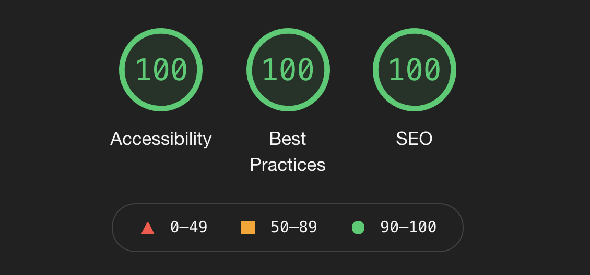

# Overlook Hotel Booker

  
  
## Table of Contents

- [About the Project](#about-the-project)
  - [Final Product](#final-product)
- [Project Goals](#project-goals)
- [Installation](#installation)
- [Technologies Used](#technologies-used)
- [Wireframes](#wireframes)
- [Functionality](#functionality)
  - [General](#general)
  - [Error Handling](#error-handling)
  - [Mobile View](#mobile-view)
  - [Tablet View](#tablet-view)
  - [Accessibility](#accessibility)
- [Contributors](#contributors)
- [Contact](#contact)

## About the Project

In this project,my job was to take information from an API and create a functional website using that data. The data is for a hotel and contained booking, room, and customer information. 

Project spec ->
https://frontend.turing.io/projects/overlook.html

#### Final Product:

## Project Goals 
1. Gain competency with React.
2. Create mutipage using Router.
3. Make network requests to API endpoints to retrieve and manipulate data.
4. Use Object Oriented Programming (OOP) to drive the design of the application and the code.
5. Create a testing using Cypress that thoroughly tests all the functional aspects of the application.
6. Ensure the app is following best accessibility practices.
7. Leverage SASS to DRY up CSS.
8. Make the app responsive so that content can be viewed on all devices.

## Installation
View the code -> 
https://github.com/aemiers/rancid-tomatillos

## Technologies Used

- 

- 

- 

- 

- 

- 

- 

## Wireframes

## Functionality

#### General
Rancid Tomatillos is a versatile web application that enables its users to browse, search, filter, and view rated movies. Once the user selects a video, an expanded details page opens revealing further information such as run time, genre, and the summary. A trailer clip is also available for the user to view. 

#### Error Handling
Error handling was considered when building the website.

#### Responsiveness
##### Mobile View

##### Tablet View

#### Accessibility
Rancid Tomatillos received a 100% from Lighthouse on Accessibility. Users can tab throughout the full application, making it accessible for those using keyboards to navigate through. 

## Contact the Contributers
[][linkedin]
[][github]

[][linkedin2]
[][github2]

<!-- Personal Definitions  -->
[linkedin]: https://www.linkedin.com/in/anneke-miers/
[github]: https://github.com/aemiers
[linkedin2]: https://www.linkedin.com/in/matt-umland-he-him-4264455b/
[github2]: https://github.com/mattumland
